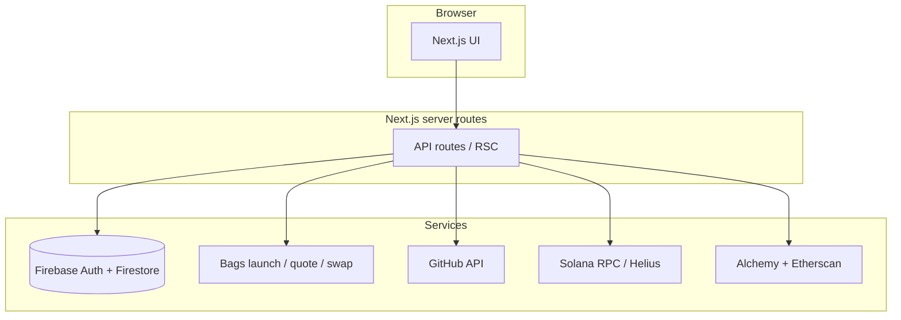

# Buildry

### Reputation in public — social, provable, launch-ready

**Buildry** is a full-stack social platform where founders, developers, investors, and recruiters **earn trust from what they ship**, not from a static profile. We combine a **real-time feed**, **verifiable identity signals** (GitHub + Solana + EVM), and **native token launches** via [**Bags**](https://bags.fm) so “who you are” and “what you launched” live in **one** product experience.

| | |
| --- | --- |
| **Live demo** | *Add your deployed URL* |
| **Demo video** | *Add Loom / YouTube* |
| **Repository** | [github.com/Shijas786/BUILDRY](https://github.com/Shijas786/BUILDRY) |

**Team** — *Add names, roles, and links here if you publish them.*

---

## Why this stands out

1. **Real product surface, not a slide** — Auth, feed, social graph, profiles, invest/deals/grants flows, jobs, and token pages are implemented end-to-end in **Next.js 14**, not mocked in Figma.
2. **Hard integration work** — Multi-provider **reputation aggregation** (GitHub activity, Helius-backed Solana sampling, optional multi-chain EVM via Alchemy, Etherscan contract-creation signal) feeds a coherent **builder profile API**; **Bags** powers **launch + quote + swap** server routes wired to the UI.
3. **Clear narrative** — We solve **fragmented reputation** (résumés, noisy timelines, disconnected onchain history) by making **posts + proof + launches** first-class in the same app.

---

## What we built

**Social layer**
- Role-aware onboarding (**developer / founder / investor / recruiter**)
- **Feed** with composer, likes, comments, infinite scroll
- **Follow** graph and **explore** paths for discovery
- Rich **profiles**: posts, projects, tokens, activity, services
- **Settings**: profile editing, social links, skills, projects, availability

**Trust & proof**
- Linked socials (e.g. GitHub, LinkedIn, Farcaster) with server-enriched context where keys are present
- **GitHub** public activity and repository signal; optional GraphQL for deeper contribution stats
- **Onchain history**: Solana (e.g. Helius) plus optional **EVM** rollups and **Etherscan** contract-creation / gas signal for deploy credibility
- Optional **AI-assisted “builder snapshot”** on public profiles when `ANTHROPIC_API_KEY` is set (factual, signal-grounded copy)

**Capital & careers**
- **Invest** hub: deals, grants/fellowships, token trading entry points
- **Jobs** board APIs and UI integration

**Tokens (Bags)**
- **Launch** flow (`/launch`, `POST /api/launch`)
- **Quote & swap** pipeline (`POST /api/quote`, `POST /api/swap`) with Bags SDK / API
- **Token detail** surfaces (`/token/[mint]`, trending + per-mint APIs)

**Auth & wallets**
- Email/password, **Google OAuth**, and **wallet connect** via **Reown AppKit** with **Solana + EVM** adapter support for a serious multi-chain UX

---

## Technical highlights

- **Composable data plane** — `GET /api/profile/[username]` aggregates posts, projects, and a **`contributions`** object (GitHub, Solana txs + deploy heuristics, optional EVM chains, Etherscan, counts) for one coherent profile payload.
- **Graceful degradation** — Many features work with **partial env**; missing keys disable enrichments without bricking core auth/feed.
- **Production-shaped** — Firebase rules/indexes, Vercel-oriented deployment notes, and OAuth redirect patterns are documented for real shipping, not demo-only shortcuts.

---

## Stack

| Layer | Choices |
| --- | --- |
| **App** | Next.js 14 (App Router), TypeScript, Tailwind CSS |
| **Data / auth** | Firebase Auth, Firestore |
| **Client state** | Zustand |
| **Wallets** | Reown AppKit, Wagmi, Solana wallet adapter |
| **Tokens** | Bags SDK / Bags API |
| **Signals** | GitHub API, Helius, Alchemy (optional multi-chain), Etherscan, Neynar (Farcaster), optional Zerion / Claude |

---

## Architecture (high level)



---

## Quick Start

```bash
git clone https://github.com/Shijas786/BUILDRY.git
cd BUILDRY
npm install
npm run dev
```

Open `http://localhost:3000`.

---

## Documentation map

Everything below this line is **reference** for operators: environment variables, production domain checklist (e.g. `buildry.in`), Firebase Hosting for OAuth redirects, LinkedIn/GitHub/Farcaster setup, and extended API/route notes. For a quick picture of the product, the sections above plus **Main Routes** and **API Highlights** cover most of what you need.

---

## Environment Variables

Create `.env.local`:

```env
# Firebase (client)
NEXT_PUBLIC_FIREBASE_API_KEY=
NEXT_PUBLIC_FIREBASE_AUTH_DOMAIN=
NEXT_PUBLIC_FIREBASE_PROJECT_ID=
NEXT_PUBLIC_FIREBASE_STORAGE_BUCKET=
NEXT_PUBLIC_FIREBASE_MESSAGING_SENDER_ID=
NEXT_PUBLIC_FIREBASE_APP_ID=
# Optional: only if Firebase OIDC Provider ID is not `linkedin` (default client id is oidc.linkedin)
# NEXT_PUBLIC_FIREBASE_LINKEDIN_PROVIDER_ID=oidc.linkedin
# While LinkedIn has not approved your app’s OpenID Connect product, hide broken OAuth and show “coming soon” in Settings:
# NEXT_PUBLIC_LINKEDIN_OAUTH_COMING_SOON=1

# Firebase Admin (server routes)
FIREBASE_PROJECT_ID=
FIREBASE_CLIENT_EMAIL=
FIREBASE_PRIVATE_KEY=

# Auth/social helpers (production: e.g. buildry.in — no scheme)
NEXT_PUBLIC_APP_DOMAIN=localhost
NEXT_PUBLIC_TELEGRAM_BOT_NAME=
TELEGRAM_BOT_TOKEN=

# Wallet / chain
NEXT_PUBLIC_REOWN_PROJECT_ID=
NEXT_PUBLIC_SOLANA_NETWORK=mainnet-beta
NEXT_PUBLIC_SOLANA_RPC_URL=https://api.mainnet-beta.solana.com
SOLANA_RPC_URL=https://api.mainnet-beta.solana.com

# Bags
BAGS_API_KEY=
PLATFORM_TREASURY_WALLET=
PLATFORM_FEE_BPS=100

# Reputation / data providers
HELIUS_API_KEY=
# Multi-chain EVM (outgoing nonce + transfer sample per network). Enable chains in Alchemy dashboard.
ALCHEMY_API_KEY=
# Optional: Zerion wallet APIs (tx history, portfolio, etc.) — https://developers.zerion.io
ZERION_API_KEY=
ETHERSCAN_API_KEY=
NEYNAR_API_KEY=
TAPESTRY_API_KEY=
# Optional: GitHub GraphQL for builder “Commits (GitHub graph)” on profiles (classic PAT: read:user). Falls back to GITHUB_TOKEN.
# GITHUB_GRAPHQL_TOKEN=
# GITHUB_TOKEN=

# Optional AI layer
CHAINGPT_API_KEY=
# Claude (Anthropic) — public builder profile “Builder snapshot” narrative on /profile/[username]
# Add in Vercel → Settings → Environment Variables (Production), then redeploy. Not NEXT_PUBLIC_*.
ANTHROPIC_API_KEY=
# Optional override, default claude-haiku-4-5-20251001
# ANTHROPIC_MODEL=
```

Notes:
- The app can run with partial/missing keys (some modules degrade gracefully).
- Keep `.env.local` out of git.
- **Farcaster “Sign in” (QR / phone scan):** In the [Farcaster developer portal](https://farcaster.xyz/~/developers), the app domain must match the **exact hostname** users open (e.g. `buildry.in` **or** `www.buildry.in` — they are not interchangeable). Auth Kit now sends SIWE using `window.location.hostname` and `origin`, so if Warpcast shows **“Sign in failed”** after you tap Sign in, add the host you actually use to the Farcaster app, or redirect all traffic to one canonical host on Vercel. `NEXT_PUBLIC_APP_DOMAIN` is still used for SSR placeholders and docs; optional: `NEXT_PUBLIC_OPTIMISM_RPC_URL`, `NEXT_PUBLIC_FARCASTER_AUTH_RELAY`.
- **Public profile “Connected profiles”:** LinkedIn uses stored OIDC fields (`linkedin_data`). GitHub merges the public GitHub API with the OAuth snapshot (`github_data`). Farcaster uses **Neynar** (`NEYNAR_API_KEY`) for live followers/bio when possible; without a key, the card still shows data saved at connect time.
- **Ship log + AI snapshot:** `/api/profile/[user]` includes a **`contributions`** object (GitHub repos/stars/365d public-activity score from events, optional GraphQL **`totalCommitContributions`** sum over the last five calendar years when **`GITHUB_GRAPHQL_TOKEN`** or **`GITHUB_TOKEN`** is set, Helius-sampled Solana txs + deploy heuristic, optional **`ALCHEMY_API_KEY`** multi-chain EVM rollups, Etherscan-mainnet contract-creation + gas when **`ETHERSCAN_API_KEY`** is set, project/post counts). **`ANTHROPIC_API_KEY`** enables a cached Claude “Builder snapshot” blurb that combines LinkedIn/GitHub/Farcaster hints with those signals (still factual, no key = UI explains how to enable).

---

## Production domain (`buildry.in`)

Use this checklist when pointing **GoDaddy** at **Vercel** and enabling auth everywhere.

### 1) Vercel — attach the domain

1. [Vercel Dashboard](https://vercel.com) → project **buildry** → **Settings** → **Domains**.
2. Add **`buildry.in`** and **`www.buildry.in`**.
3. Vercel will show the exact DNS targets; if you use external DNS at GoDaddy, the usual pattern is:
   - **A** record: **Host** `@` → **Value** `76.76.21.21`
   - **CNAME** record: **Host** `www` → **Value** `cname.vercel-dns.com`  
   (Confirm in the Vercel UI — values can change.)

### 2) GoDaddy — DNS

1. GoDaddy → **My Products** → your domain **buildry.in** → **DNS** / **Manage DNS**.
2. Add or edit records as Vercel instructs (often the **A** + **www CNAME** above).
3. Remove conflicting **A**/**CNAME** on `@` or `www` if the site pointed elsewhere before.
4. Wait for propagation (often minutes; up to 48 hours).

### 3) Firebase — authorized domains

Firebase Console → **Authentication** → **Settings** → **Authorized domains** — add:

- `buildry.in`
- `www.buildry.in`

(Keep `localhost` for local dev.)

### 3b) Firebase Hosting — required for GitHub / redirect OAuth

The Auth redirect page at `https://<project-id>.firebaseapp.com/__/auth/handler` loads **`__/firebase/init.json`** from the same host. That file is a [reserved Hosting URL](https://firebase.google.com/docs/hosting/reserved-urls) and is **only served after you deploy Firebase Hosting** for the project. If `init.json` returns **404**, GitHub (and similar) link flows fail in the handler with a console error like `GET .../init.json 404`.

After linking the CLI (`npx firebase login`) and with `.firebaserc` pointing at your project:

```bash
npm run firebase:deploy:hosting
```

This deploys the minimal static site in **`firebase-hosting-public/`** (the real app stays on Vercel). You only need to redeploy Hosting when you add Firebase web apps or change config in a way that requires updating reserved config (rare).

### 3c) Firebase — Firestore rules & indexes

The repo includes **`firestore.rules`** and **`firestore.indexes.json`**. After cloning or changing them, deploy to your **production** Firebase project (same project as `NEXT_PUBLIC_FIREBASE_PROJECT_ID`):

```bash
# one-time on your machine: sign in to the Google account that owns the Firebase project
npx firebase login
# default project is set in .firebaserc (buildry-18c42); override: npx firebase use <your-project-id>
npm run firebase:deploy:firestore
# equivalent: npx firebase deploy --only firestore:rules,firestore:indexes
```

If a query fails at runtime, the browser or server log usually links to the **Firestore console** to create a missing composite index; you can then copy the suggested index into `firestore.indexes.json` and redeploy.

**Production checklist**

| Item | Notes |
|------|--------|
| Hosting deployed | Run `npm run firebase:deploy:hosting` so `__/firebase/init.json` exists for the Auth redirect handler (GitHub / `linkWithRedirect`). |
| Rules deployed | Client SDK needs rules that allow **your own** `users/{uid}`, **`builder_profiles/{uid}`** writes, and **`projects`** for your `builder_id`. The default in this repo matches the app; **deny-all** rules break sign-in/settings. |
| Admin env on Vercel | `FIREBASE_PROJECT_ID`, `FIREBASE_CLIENT_EMAIL`, `FIREBASE_PRIVATE_KEY` (multiline key: paste with `\n` for newlines, or use JSON service account in a secret manager). |
| Client env | All `NEXT_PUBLIC_FIREBASE_*` vars from the Firebase project settings. |
| Service account | Use a dedicated key with minimal roles; rotate if leaked. |
| Optional hardening | [App Check](https://firebase.google.com/docs/app-check) for abuse resistance on client-facing Firebase APIs. |

### 4) Google sign-in (Firebase / Google Cloud)

Google Cloud Console → **APIs & Services** → **Credentials** → your **Web client** → **Authorized JavaScript origins**:

- `https://buildry.in`
- `https://www.buildry.in`

### 5) Env on Vercel

Set **`NEXT_PUBLIC_APP_DOMAIN`** to `buildry.in` (no `https://`) in Vercel **Environment Variables** for **Production**, or run `npm run vercel:env-sync` after updating `.env.local` or `.env` (the script prefers `.env.local`, then `.env`; Supabase keys are skipped).

If **`GITHUB_GRAPHQL_TOKEN`** is missing on **Preview** deployments, add it in the Vercel dashboard for the **Preview** environment (the CLI often requires a specific Git branch for preview-only secrets when the production branch is `main`).

**Google shows `firebaseapp.com` in the sign-in UI** when `NEXT_PUBLIC_FIREBASE_AUTH_DOMAIN` is still your `*.firebaseapp.com` project host. To show **`buildry.in`** in the OAuth flow while the app stays on Vercel:

1. **Firebase** → Authentication → Settings → **Authorized domains** — include `buildry.in` and `www.buildry.in` (if you use both).
2. **Vercel (Production)** — set **`NEXT_PUBLIC_FIREBASE_AUTH_DOMAIN=buildry.in`** (hostname only, no `https://`; use the same host users open in the browser, apex or `www`, not both unless you redirect one to the other).
3. **Local dev** — keep **`NEXT_PUBLIC_FIREBASE_AUTH_DOMAIN=buildry-18c42.firebaseapp.com`** (or your project id) in `.env.local` so `/__/auth/*` does not need to hit Vercel.
4. This repo **proxies** `/__/auth/*` and `/__/firebase/*` to **`https://<NEXT_PUBLIC_FIREBASE_PROJECT_ID>.firebaseapp.com`** via `next.config.js` `rewrites()` (requires `NEXT_PUBLIC_FIREBASE_PROJECT_ID` at build time on Vercel).
5. **Google Cloud Console** → APIs & Services → **Credentials** → Web client used by Firebase → add **Authorized redirect URI**: `https://buildry.in/__/auth/handler` (and `https://www.buildry.in/__/auth/handler` if applicable). **Authorized JavaScript origins** should already list `https://buildry.in` (see above).

If you skip step 2, **`NEXT_PUBLIC_FIREBASE_AUTH_DOMAIN` stays `buildry-18c42.firebaseapp.com`** and Google may continue to show the Firebase host.

### 6) LinkedIn / GitHub — redirect URI must match Firebase

LinkedIn’s **“The redirect_uri does not match the registered value”** means the URL in your LinkedIn app is not **byte-for-byte** the same as what Firebase sends. Register **both**:

- `https://<YOUR_PROJECT_ID>.firebaseapp.com/__/auth/handler`
- `https://<YOUR_PROJECT_ID>.web.app/__/auth/handler`

If production uses **`NEXT_PUBLIC_FIREBASE_AUTH_DOMAIN=buildry.in`**, also register **`https://buildry.in/__/auth/handler`** (and `www` if used) on LinkedIn/GitHub. Otherwise keep the **`firebaseapp.com`** / **`web.app`** handler URLs below.

Use the same pattern for **GitHub OAuth App → Authorization callback URL**.

The **Settings → Socials** page shows a **Copy** button for the exact callback URL from `NEXT_PUBLIC_FIREBASE_AUTH_DOMAIN`.

---

## Google OAuth Signup Setup (Firebase)

Buildry uses Firebase Auth for Google sign-in/sign-up.

### 1) Create Google OAuth credentials

In Google Cloud Console:
- Go to **APIs & Services -> Credentials**
- Create **OAuth client ID** (Web application)
- Add your frontend origins:
  - `http://localhost:3000`
  - your production domain (for example `https://yourdomain.com`)
- You do not need a Supabase callback URL for Firebase popup auth.

### 2) Configure Firebase Auth provider

In Firebase Console:
- Go to **Authentication -> Sign-in method**
- Enable **Google**
- Save

### 3) Add authorized domains

In Firebase Console:
- Go to **Authentication -> Settings -> Authorized domains**
- Add:
  - `localhost`
  - your production domain

### 4) Ensure local env is set

Your `.env.local` must include:

```env
NEXT_PUBLIC_FIREBASE_API_KEY=
NEXT_PUBLIC_FIREBASE_AUTH_DOMAIN=
NEXT_PUBLIC_FIREBASE_PROJECT_ID=
NEXT_PUBLIC_FIREBASE_APP_ID=
```

### 5) Test the flow

- Run `npm run dev`
- Click **Continue with Google** in auth modal
- After consent, Firebase signs the user in immediately
- App sends new users to onboarding and returning users to feed

### Common issues

- **Popup blocked**: allow popups for your app domain and try again.
- **Google sign-in button fails**: verify Firebase Google provider is enabled.
- **Works locally, fails in prod**: production domain not added in Firebase authorized domains.

---

## LinkedIn (Settings → Socials)

Buildry links LinkedIn to your **existing** Firebase account (Google/email) from **Settings → Socials → Connect LinkedIn**. Firebase often **does not** show a “LinkedIn” tile in the provider list — use **Custom providers → OpenID Connect** instead. The app uses `OAuthProvider('oidc.linkedin')` by default (`linkWithPopup`). If you choose a different Provider ID in Firebase, set `NEXT_PUBLIC_FIREBASE_LINKEDIN_PROVIDER_ID=oidc.yourid` in `.env.local`.

**LinkedIn product access pending:** If LinkedIn has not approved **Sign In with LinkedIn using OpenID Connect** for your app yet, OAuth will fail for everyone. Set **`NEXT_PUBLIC_LINKEDIN_OAUTH_COMING_SOON=1`** in Vercel (and locally if you want). Settings → Socials will show a **coming soon** message, disable **Connect LinkedIn**, and users can still **paste their profile URL** and **Save URL**. Remove the variable or set it to `0` when LinkedIn approves your app.

### 1) LinkedIn Developer app

1. [LinkedIn Developers](https://www.linkedin.com/developers/apps) → create or open your app.
2. Under **Products**, add **Sign In with LinkedIn using OpenID Connect**.
3. **Auth** tab → **Authorized redirect URLs for your app** — add **both** (replace project id if yours differs), https, no trailing slash:

   - `https://buildry-18c42.firebaseapp.com/__/auth/handler`
   - `https://buildry-18c42.web.app/__/auth/handler`

   The browser may show a long Firebase URL with `apiKey`, `linkViaRedirect`, and `redirectUrl=https://buildry.in/...` — that is expected; LinkedIn still only validates the **handler** origin + path above.

4. Copy **Client ID** and **Client Secret**.

5. If LinkedIn shows a generic **“Bummer, something went wrong”** but redirect URLs look correct, set **`NEXT_PUBLIC_LINKEDIN_OIDC_SKIP_EMAIL=1`** in Vercel (removes the `email` OIDC scope until LinkedIn fully provisions it on your app).

### 2) Firebase — OpenID Connect (not a “LinkedIn” row)

1. [Firebase Console](https://console.firebase.google.com/) → **Authentication** → **Sign-in method** → **Add new provider**.
2. Under **Custom providers**, choose **OpenID Connect**.
3. **Provider ID**: `linkedin` (must match the app default: client uses `oidc.linkedin`).
4. **Issuer (URL)**: `https://www.linkedin.com/oauth`  
   (LinkedIn’s discovery doc is at `https://www.linkedin.com/oauth/.well-known/openid-configuration`.)
5. **Client ID** and **Client secret**: paste from LinkedIn. Save.
6. Some projects only show OIDC after **Identity Platform** is enabled; if you do not see OpenID Connect, upgrade Auth per Firebase’s prompt for your project.

### 3) Domains

**Authentication → Settings → Authorized domains** must include where the app runs (e.g. `buildry.in`, `www.buildry.in`, `localhost`).

### 4) Test

Sign in with Google → **Settings** → **Socials** → **Connect LinkedIn**. The app uses a **full-page redirect** (not a popup) so strict browser **Cross-Origin-Opener-Policy** rules do not break the flow. After LinkedIn sends you back, you should land on **Settings** with the Socials tab focused and a confirmation message. If the profile URL does not auto-fill, paste your public URL and click **Save URL**.

### 5) “redirect_uri does not match” (LinkedIn)

1. Open **Settings → Socials** on Buildry and copy the **Firebase OAuth callback** URL (or build it from `NEXT_PUBLIC_FIREBASE_AUTH_DOMAIN`).
2. LinkedIn Developers → your app → **Auth** → **Authorized redirect URLs** → add that URL **exactly** (https, no trailing slash, correct subdomain).
3. Ensure the **Client ID** in that same LinkedIn app is what you pasted into Firebase **OpenID Connect** (not an old / duplicate app).

---

## Farcaster (website vs Mini Apps)

- **This Next.js app** uses **`@farcaster/auth-kit`** (QR / Sign in with Farcaster on the **open web**). Register your domain (e.g. `buildry.in`) in the [Farcaster developer portal](https://farcaster.xyz/~/developers) and keep **`NEXT_PUBLIC_APP_DOMAIN`** aligned (apex vs `www` matters for SIWE).
- **[`sdk.actions.signIn`](https://miniapps.farcaster.xyz/docs/sdk/actions/sign-in)** in the **Mini Apps SDK** is for experiences **running inside Warpcast**, not for replacing Auth Kit on a normal website.

---

## GitHub (Settings → Socials)

Buildry links GitHub to your **existing** Firebase account from **Settings → Socials → Connect GitHub** (`GithubAuthProvider` + **full-page redirect**). Your public GitHub username is written to `github_username` for profile stats and repo imports.

### 1) GitHub OAuth App

1. GitHub → **Settings** → **Developer settings** → **OAuth Apps** → **New OAuth App** (or open an existing app).
2. **Authorization callback URL** — add **exactly** (replace project id if yours differs):

   `https://buildry-18c42.firebaseapp.com/__/auth/handler`

3. Copy **Client ID** and generate a **Client secret**.

### 2) Firebase — GitHub provider

1. [Firebase Console](https://console.firebase.google.com/) → **Authentication** → **Sign-in method** → **Add new provider** → **GitHub**.
2. Paste **Client ID** and **Client secret** from GitHub. Save.

### 3) Test

Sign in with Google (or email) → **Settings** → **Socials** → **Connect GitHub**. You can still type a username and use **Save username** without OAuth.

---

## Main Routes

- `/` → public landing page
- `/feed` → social feed + live builder context
- `/explore` → builder discovery
- `/profile/[username]` → public builder profile
- `/settings` → edit profile, socials, projects, availability
- `/invest` → deals, grants, token trading
- `/jobs` → hiring board
- `/launch` → token launch flow
- `/token/[mint]` → token detail/trade context

---

## API Highlights

- `GET/POST /api/posts`
- `POST /api/posts/[id]/like`
- `GET/POST /api/posts/[id]/comments`
- `POST /api/follow`
- `GET/POST /api/jobs`
- `GET/POST /api/deals`
- `GET/POST /api/grants`
- `GET /api/profile/[username]`
- `GET /api/talent/top-builders` (legacy/mock profile source; optional)
- `GET /api/tokens/trending`
- `GET /api/tokens/[mint]`
- `POST /api/launch`
- `POST /api/quote`
- `POST /api/swap`

---

## Project Structure (Simplified)

```txt
app/
  api/
  feed/
  explore/
  invest/
  launch/
  profile/[username]/
  settings/
components/
context/
hooks/
lib/
store/
supabase/
```

---

## Shipped today & roadmap

**Live in this codebase:** end-to-end **social + proof + Bags**—sign-in, feed, follows, invest/jobs surfaces, enriched profiles, and **launch / quote / swap** flows where keys and network allow.

**Next:** stronger abuse resistance (e.g. App Check at scale), deeper Farcaster/Tapestry graph features, richer holder/trust analytics on tokens, and more automated verification tiers—without losing the idea that **reputation is earned in public** and backed by **inspectable signal** (GitHub + onchain + linked identities).
